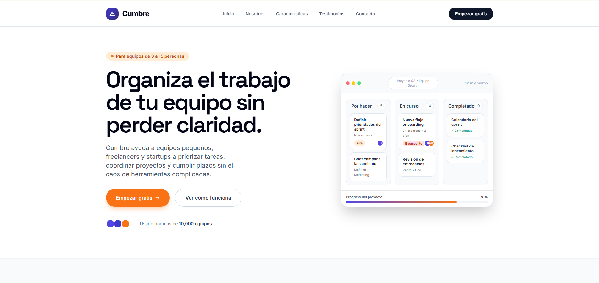
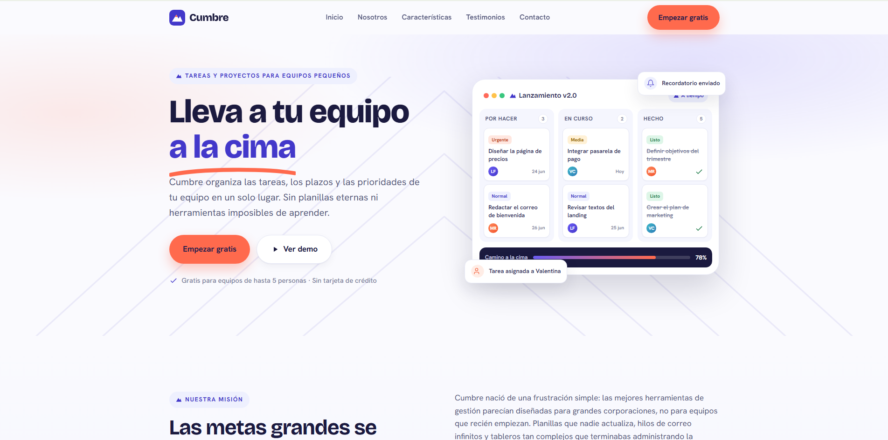

# PFO2 - Comparativa de Agentes de IA — Generación de una Landing Page

Trabajo práctico: diseño de un **único prompt de alta precisión** ejecutado en **dos agentes de desarrollo** para comparar su capacidad de resolución autónoma. Ambos agentes reciben exactamente la misma instrucción y **no se modifica su código de forma manual**, de modo que lo que se evalúa es la efectividad del prompt inicial.

---

## 1. Datos del estudiante

- **Nombre y apellido:** _[IMPERIALES JEREMIAS LEON]_
- **Materia :** _[DESARROLLO WEB FRONTEND]_

## 2. Deploy unificado

- **Portada (Vercel):** _[https://pfo-prompt-enfineering-imperialesje.vercel.app/]_

La portada contiene los tres accesos requeridos:
1. El prompt en texto plano (`prompt.txt`).
2. La landing page generada por el **Agente 1**.
3. La landing page generada por el **Agente 2**.

## 3. Agentes y modelos utilizados

| | Agente | Modelo de lenguaje |
|---|---|---|
| **Agente 1** | _[Codex (OpenAI)]_ |
| **Agente 2** | _[Claude Code]_ |

## 4. Estructura del proyecto

```
.
├── index.html          # Portada con los 3 accesos
├── prompt.txt          # El prompt exacto utilizado (Link 1)
├── agente-1/
│   └── index.html      # Landing generada por el Agente 1
├── agente-2/
│   └── index.html      # Landing generada por el Agente 2
├── capturas/
│   ├── agente-1.png
│   └── agente-2.png
└── README.md
```

## 5. El prompt exacto utilizado

> El mismo texto fue usado, sin variaciones, en ambos agentes.

```text
# ROL Y OBJETIVO
Actúa como desarrollador/a frontend senior y diseñador/a de UI/UX
especializado/a en landing pages modernas, accesibles y orientadas a la
conversión. Tu tarea es generar una landing page COMPLETA y lista para
producción a partir del brief y los requisitos detallados abajo.

# ENTREGABLE Y RESTRICCIONES TÉCNICAS
- Genera UN ÚNICO archivo `index.html` autocontenido, con todo el HTML, CSS y
  JavaScript embebidos en el mismo archivo.
- El CSS va dentro de una etiqueta <style> en el <head> (puedes usar Tailwind
  CSS por CDN si lo prefieres). El JavaScript necesario (menú móvil, scroll
  suave y confirmación visual del formulario) va dentro de una etiqueta <script>.
- Sin paso de build, sin dependencias que haya que instalar, sin backend. El
  archivo debe poder abrirse directamente en el navegador y desplegarse como
  sitio estático en Vercel sin configuración adicional.
- Usa HTML5 semántico: <header>, <nav>, <main>, <section>, <footer>, etc.
- No uses archivos locales externos (imágenes, CSS o JS aparte). Para imágenes e
  íconos usa SVG inline, emojis o elementos hechos con CSS. Puedes cargar fuentes
  y Tailwind por CDN.

# BRIEF DEL PROYECTO
- Producto: "Cumbre", una plataforma SaaS de gestión de tareas y proyectos para
  equipos pequeños, freelancers y startups.
- Propuesta de valor: ayuda a los equipos a organizar el trabajo, priorizar lo
  importante y cumplir plazos sin el caos de las herramientas complicadas.
  Eslogan: "Lleva a tu equipo a la cima".
- Público objetivo: líderes de equipos de 3 a 15 personas, freelancers y
  fundadores de startups de habla hispana.
- Tono de marca: cercano, profesional, motivador y claro; inspirador, sin
  tecnicismos innecesarios.
- Dirección visual sugerida: color principal en la familia azul/índigo
  (confianza, profesionalismo) y un color de acento cálido (coral o naranja)
  reservado para los botones de acción (CTA). Fondos claros y mucho espacio en
  blanco.

# SECCIONES OBLIGATORIAS (en este orden)
1. CABECERA (Header): logo "Cumbre" a la izquierda; menú de navegación con
   enlaces ancla a las secciones (Inicio, Nosotros, Características, Testimonios,
   Contacto) y un botón CTA destacado ("Empezar gratis"). Debe ser fijo (sticky)
   al hacer scroll y responsive: en móvil el menú colapsa en un ícono hamburguesa
   funcional mediante JavaScript.
2. HERO: título principal (h1) impactante que comunique la propuesta de valor;
   subtítulo breve que la explique; un CTA primario ("Empezar gratis") y uno
   secundario ("Ver demo"). Incluye un apoyo visual atractivo creado con HTML/CSS
   o SVG inline (por ejemplo, un mockup estilizado de la interfaz del producto).
   Debe ocupar buena parte de la primera pantalla.
3. SOBRE NOSOTROS / DESCRIPCIÓN: uno o dos párrafos sobre la misión de Cumbre y
   por qué existe, más 3 métricas destacadas presentadas de forma visual (por
   ejemplo: "+10.000 equipos activos", "98% de satisfacción", "4,9/5 de
   valoración media").
4. CARACTERÍSTICAS PRINCIPALES: una grilla de 4 a 6 características o beneficios;
   cada una con un ícono (SVG inline o emoji), un título corto y una descripción
   de una o dos líneas. Ideas: tableros visuales, asignación de tareas,
   recordatorios automáticos, seguimiento de progreso, colaboración en tiempo
   real, integraciones.
5. TESTIMONIOS: 3 reseñas de clientes ficticias pero realistas; cada una con la
   cita, el nombre de la persona, su cargo y empresa, un avatar (puede ser un
   círculo con iniciales hecho con CSS) y una valoración con estrellas.
6. FORMULARIO DE CONTACTO: maquetado visual, sin backend. Campos: nombre, email,
   empresa/asunto y mensaje, más un botón de envío. Etiquetas (labels) accesibles
   asociadas a cada campo, estados de foco visibles y un diseño cuidado. Al
   enviar, evita la recarga con JavaScript (event.preventDefault) y muestra un
   mensaje visual de confirmación; no debe llamarse a ningún servidor.
7. PIE DE PÁGINA (Footer): nombre/logo y eslogan breve; columnas de enlaces
   (Producto, Empresa, Legal); enlaces a redes sociales con íconos SVG inline
   (X/Twitter, LinkedIn, Instagram, GitHub) y una línea de copyright.

# REQUISITOS DE DISEÑO
- Diseño responsive con enfoque mobile-first: debe verse y funcionar bien en
  móvil, tablet y escritorio.
- Estética moderna y limpia: jerarquía tipográfica clara, espaciado generoso,
  esquinas redondeadas suaves y sombras sutiles.
- Tipografía mediante Google Fonts por CDN (por ejemplo Inter o Poppins) o
  fuentes del sistema.
- Paleta de colores coherente definida con variables CSS (o la configuración de
  Tailwind), con buen contraste para la legibilidad.
- Micro-interacciones: estados hover en botones y enlaces, transiciones suaves y
  desplazamiento suave (smooth scroll) al hacer clic en los enlaces del menú.
- Accesibilidad: estructura semántica, contraste suficiente (WCAG AA), navegación
  por teclado con foco visible, atributos alt apropiados o aria-hidden en íconos
  decorativos, y labels asociadas a los campos del formulario.

# REQUISITOS DE CONTENIDO
- Escribe TODO el contenido (textos, titulares, características, testimonios) en
  español, realista y específico para "Cumbre". No uses texto de relleno tipo
  "Lorem ipsum" ni dejes campos vacíos: cada sección debe tener su copy final y
  creíble.
- Los nombres de personas, empresas y las cifras pueden ser ficticios, pero deben
  sonar reales.

# PROCESO
- Antes de escribir el código, planifica brevemente la estructura de las secciones
  y las decisiones de diseño (paleta, tipografía y layout).
- Luego implementa la página completa de una sola vez.
- Antes de finalizar, verifica que: estén las 7 secciones obligatorias; el menú
  móvil (hamburguesa) abra y cierre correctamente; el scroll suave funcione; y el
  formulario muestre su confirmación visual sin recargar la página.

# FORMATO DE SALIDA
- Entrega el archivo `index.html` completo y funcional, sin omitir ninguna parte
  del código ni dejar secciones "por completar". El resultado debe ser un único
  archivo que se pueda abrir y desplegar tal cual.
```

## 6. Capturas de pantalla

### Agente 1 — _[nombre del agente]_


### Agente 2 — _[nombre del agente]_


## 7. Metodología y restricciones

- Se usó **exactamente el mismo prompt** en ambos agentes, sin variaciones.
- **No se modificó manualmente** el código generado por los agentes; cada landing
  es el resultado autónomo de la instrucción inicial.
- La portada (`index.html`) integra ambos resultados en un único deploy.

## 8. Conclusiones

Ambos agentes cumplieron correctamente con todos los requisitos establecidos en el prompt, generando una landing page autocontenida, accesible y funcional para "Cumbre".

**Diferencias principales observadas:**

- **Enfoque técnico**:
  - El **Agente 1** utilizó **Tailwind CSS vía CDN** (estrategia explícitamente permitida en el prompt). Esto permitió un desarrollo rápido, excelente consistencia responsive y código más compacto y mantenible.
  - El **Agente 2** desarrolló un sistema de diseño 100% personalizado con variables CSS detalladas, dos tipografías display (Bricolage Grotesque + Hanken Grotesk) y mayor granularidad en animaciones y estados visuales.

- **Diseño y estética**:
  - Agente 1: Diseño limpio, moderno y muy usable. El mockup del hero es funcional y claro. Ideal para producción rápida.
  - Agente 2: Lenguaje visual más distintivo y con mayor personalidad. Mejor tratamiento tipográfico y de sombras. Se siente más premium.

- **Calidad del código**:
  - Agente 1 destaca por su brevedad y facilidad de lectura/modificación gracias al uso de utilidades de Tailwind.
  - Agente 2 tiene un código más extenso pero extremadamente pulido, con un sistema de diseño muy maduro.

- **Cumplimiento del brief**:
  Ambos implementaron correctamente las 7 secciones obligatorias en el orden indicado, menú hamburguesa funcional con JavaScript, scroll suave, mockup ilustrativo en el hero y formulario con confirmación visual (sin backend). No se omitieron secciones ni contenido requerido.

**Resumen**:
El Agente 1 se destaca por su **eficiencia** y por aprovechar inteligentemente las herramientas permitidas, logrando un resultado profesional y listo para deploy con menos código. El Agente 2 sobresale en la creación de un **diseño más único y elaborado** desde cero. Ambos demuestran una sólida comprensión del prompt, aunque con enfoques diferentes: velocidad + consistencia vs. control total y diferenciación visual.
